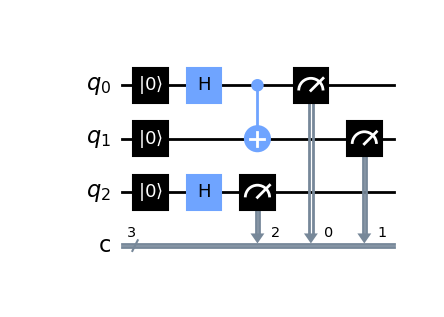

How to use Qiskit (the Python package) to define and run a quantum circuit on an IBMQ computer, then plot the results in R -- all in RStudio.

I had already installed [Anaconda](https://www.anaconda.com/products/distribution) and run:

```
pip install qiskit[visualization]
```

R libraries:

```{r}
library(reticulate)
library(tidyverse)
```

Reticulate is used to get R to communcate with Python.

Now the Qiskit code to get going...

```{python}
from qiskit import QuantumRegister, ClassicalRegister, QuantumCircuit, IBMQ, assemble, transpile, execute
from numpy import pi
from qiskit.tools import job_monitor
```

Here's a simple circuit with three qubits, two entangled.

```{python}
qreg_q = QuantumRegister(3, 'q')
creg_c = ClassicalRegister(3, 'c')
circuit = QuantumCircuit(qreg_q, creg_c)

circuit.reset(qreg_q[0])
circuit.reset(qreg_q[1])
circuit.reset(qreg_q[2])
circuit.h(qreg_q[0])
circuit.h(qreg_q[2])
circuit.cx(qreg_q[0], qreg_q[1])
circuit.measure(qreg_q[0], creg_c[0])
circuit.measure(qreg_q[1], creg_c[1])
circuit.measure(qreg_q[2], creg_c[2])
```

Draw the circuit:

```{python}
circuit.draw('mpl').show()
```

This will pop up in a new window; I can't work out how to get it to appear in the Markdown other than by saving it and inserting a png...



Enter your TOP SECRET API token here:

```{python}
IBMQ.save_account('1337', overwrite=True)
```

Load up the account:

```{python}
provider = IBMQ.load_account()
```

See what backends I can access:

```{python}
for backend in provider.backends(): print(backend)
```

Choose *ibmq_lima*:

```{python}
lima = provider.get_backend('ibmq_lima')
```

Send off the job!

```{python}
job = execute(circuit,
              backend = lima,
              shots = 1024)
job.job_id()
```

If RStudio crashes (and it did), then the job can be retrieved with:

```{python}
job = lima.retrieve_job('635aea27333aeb047289f3ba')
```

Wait for bit... then:

```{python}
job.status()
```

```{python}
res = job.result()
```

Here are the results in Python:

```{python}
vals = res.get_counts(circuit)
vals
```

We can also see them in R:

```{r}
py$vals
```

Now how do I transform that into a data frame...?

Maybe easier at the Python end:

```{python}
import pandas
df = pandas.DataFrame(list(vals.items()),
                      columns = ['Outcome', 'Freq'])
df
```

Back in R:

```{r}
py$df
```

```{r}
py$df |> 
  ggplot(aes(x = Outcome, y = Freq, fill = Outcome)) +
  geom_col() +
  theme(legend.position="none")
```


